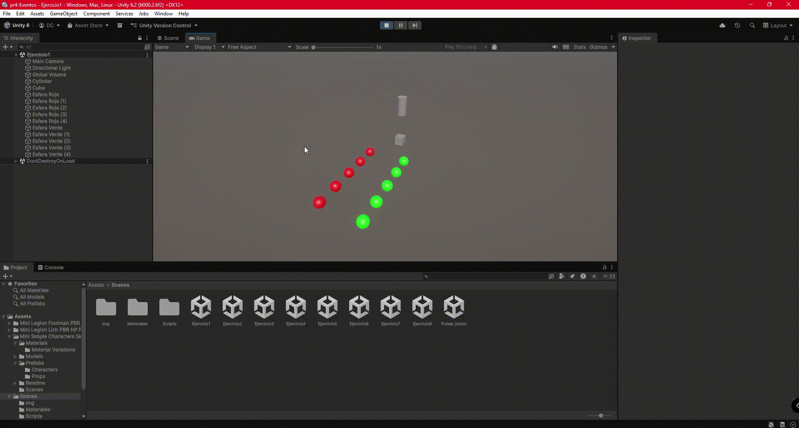
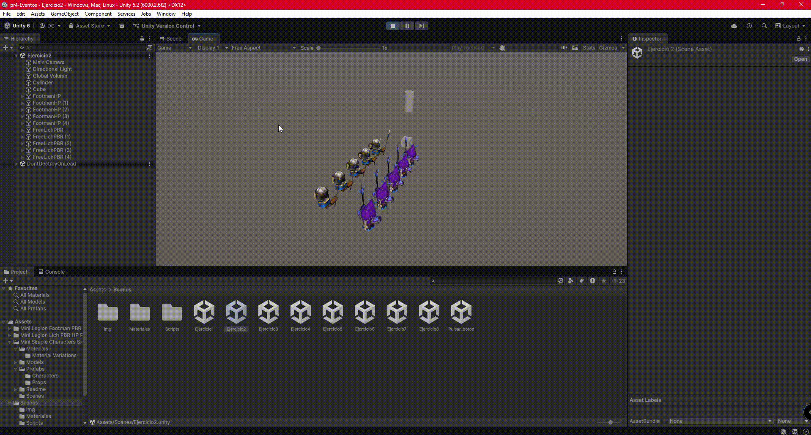
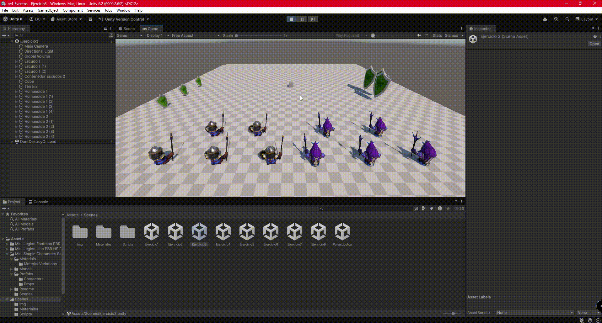
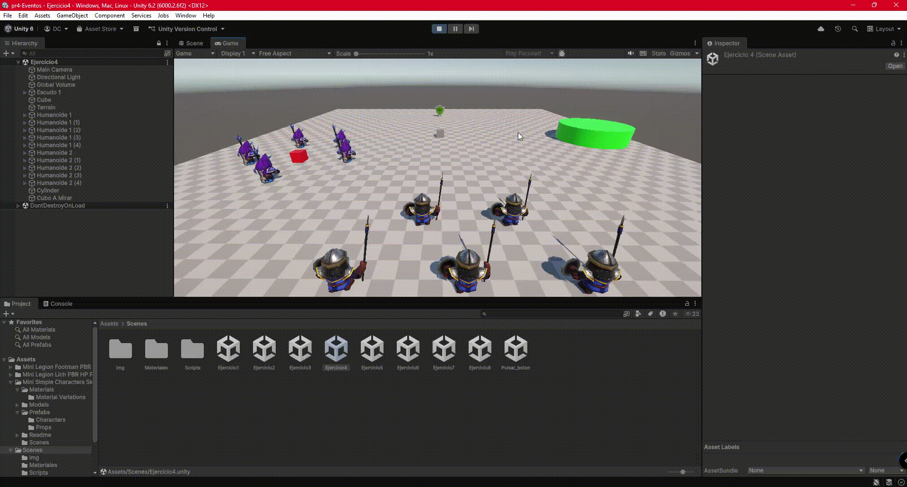
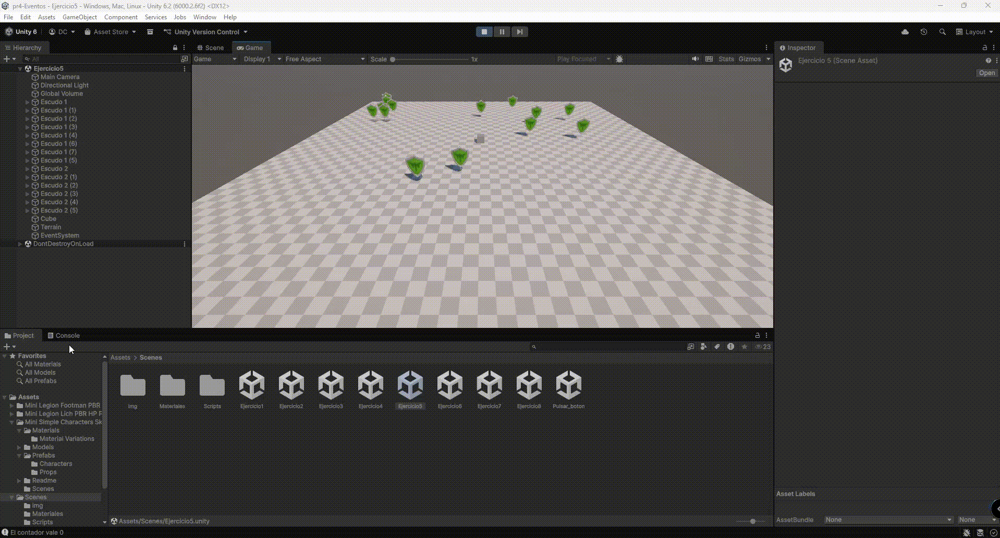
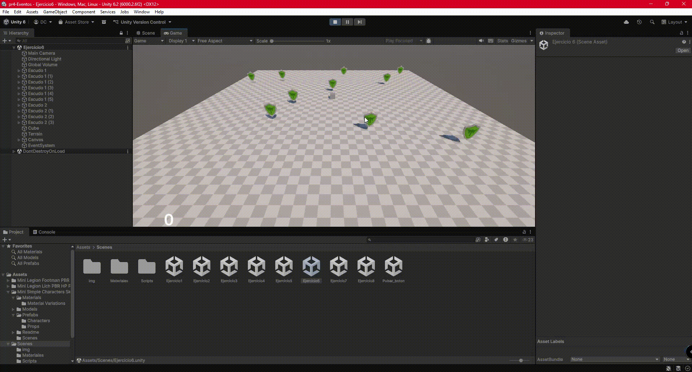
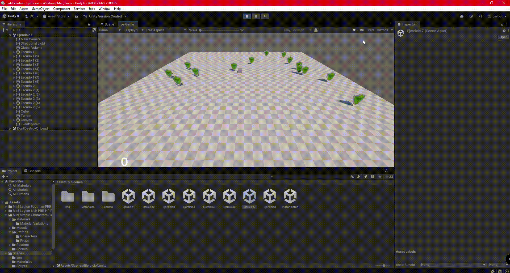
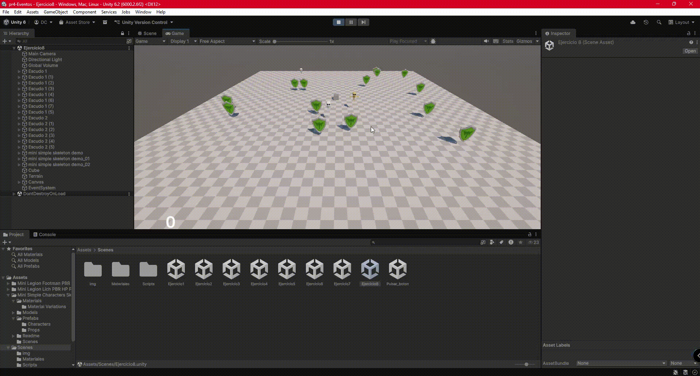

# Interfaces Inteligentes. Práctica 4. Eventos

### Ejercicio 1:
Para llevar a cabo este problema, hemos creado un [script](scripts/Ejercicio1Notificador.cs) con un `delegate` y un `event` sin parámetros y retornando `void`. Luego hemos suscrito diferentes métodos en los scripts para las [esferas tipo 1](scripts/Ejercicio1EsferasTipo1.cs) y las [esferas tipo 2](scripts/Ejercicio1EsferasTipo2.cs) respectivamente.

---

### Ejercicio 2:
En este caso no hemos tenido que hacer más que cambiar las esferas por los prefabs de los assets de la Unity Store.

---

### Ejercicio 3:
Para este apartado, hemos creado un [controlador](scripts/Ejercicio3Controlador.cs) para el cubo, al que hemos puesto como **cinemático** para poder modificar su `Transform`. Además, hemos creado una [clase](scripts/Ejercicio3NotificadorTrigger.cs) con su `delegate`, esta vez para retornar `void` y recibir un argumento, así como su `event` para poder suscribir a la [clase que maneja a los humanoides de tipo 1](scripts/Ejercicio3HumanoidesTipo1.cs). Por otra parte, hemos creado el [script para cambiar de color a los escudos](scripts/Ejercicio3CambioColor.cs).

---

### Ejercicio 4:
Para este caso concreto, hemos utilizado un [notificador similar al anterior](scripts/Ejercicio4Notificador.cs) para que a la hora de la colisión, entrasen en acción los [scripts de los humanoides tipo 1](scripts/Ejercicio4HumanoidesTipo1.cs) y [tipo 2](scripts/Ejercicio4HumanoidesTipo2.cs).

---

### Ejercicio 5:
En esta ocasión no ha sido necesario utilizar programación orientada a eventos, ya que el propio personaje lleva la cuenta de la puntuación y la actualiza en la consola. Sin embargo, sí que hemos implementado un [script](scripts/Ejercicio5AparicionAleatoria.cs) para hacer que los escudos aparezcan aleatoriamente por el terreno y [otro](scripts/Ejercicio5ManejaColisiones.cs) para desactivarlos al colisionar con ellos. 

---

### Ejercicio 6:
En este apartado hemos hecho uso del [notificador](scripts/Ejercicio3Notificador.cs) que comparte la etiqueta del objeto con el que se ha colisionado. A su vez, hemos creado otra [clase](scripts/Ejercicio6ActualizaMarcador.cs), enlazada al texto del canvas, con un método suscrito a este notificador para actualizar el marcador y [otra más](scripts/Ejercicio6ManejadorColisiones.cs) para que los escudos con los que se colisiona queden temporalmente inactivos.

---

### Ejercicio 7:
En este punto, hemos creado un [script](scripts/Ejercicio7ControladorRecompensa.cs) para controlar cuando se muestra la imagen gracias al mismo notificador del personaje que estábamos empleando en el apartado anterior.

---

### Ejercicio 8:
Para este apartado, se ha descargado un asset de la [Unity Asset Store](https://assetstore.unity.com/packages/3d/characters/humanoids/fantasy/mini-simple-characters-skeleton-free-demo-262897) y se ha hecho que al tocar el personaje a uno de estos esqueletos, se pierdan 10 puntos.

---

### Ejercicio 9:
Para realizar este ejercicio únicamente hemos tenido que dejar de hacer al controlador **cinemático**.
